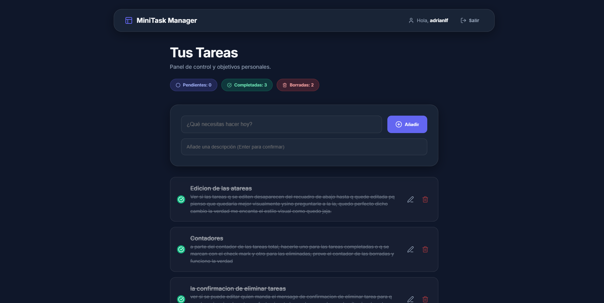
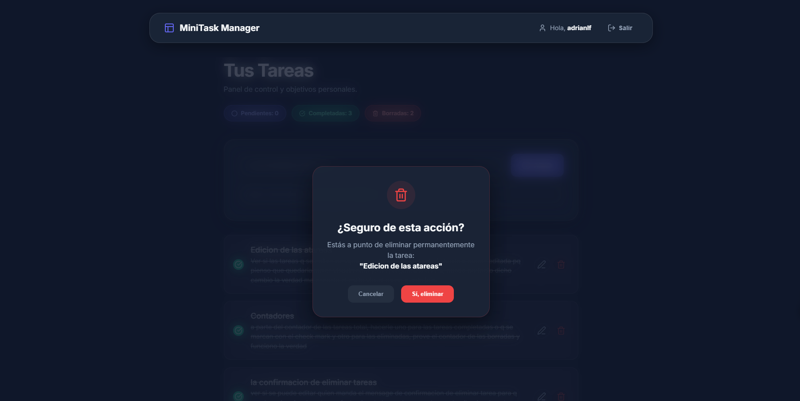
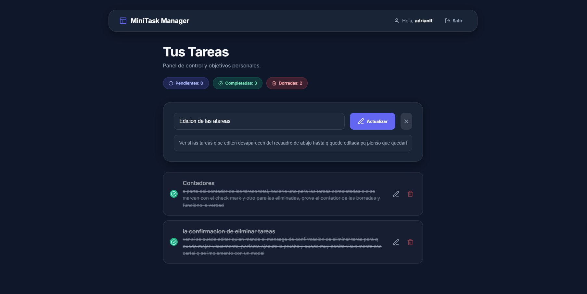
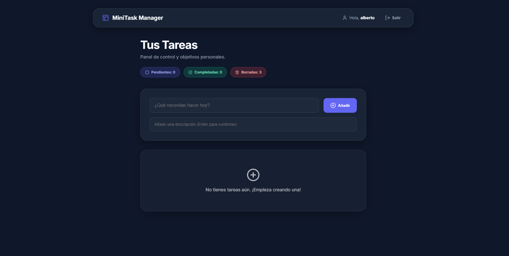

# 🚀 MiniTask Manager

**MiniTask Manager** es un ecosistema completo para la gestión de tareas, diseñado para ser ligero, intuitivo y potente. Este repositorio contiene tanto el **Backend (API)** como su aplicación cliente construida en **React**.

---

## 🖼️ Vista del Proyecto

| Vista General | Confirmación UI (Modal Premium) |
| :---: | :---: |
|  |  |

| Edición de Tareas | Interfaz Limpia |
| :---: | :---: |
|  |  |

---

## 🗂️ Estructura del Proyecto

Esta es una arquitectura desacoplada donde el frontend y el backend residen en carpetas independientes para facilitar el despliegue y desarrollo:

-   **`minitask/` (Backend):** API REST robusta desarrollada con Django y Django REST Framework. Incluye autenticación JWT, documentación Swagger interactiva y gestión de tareas personalizada.
-   **`frontend/` (Frontend):** Aplicación moderna de alto rendimiento construida con **React + Vite**.
    - **Edición Enfocada:** La tarea "sube" al formulario y se oculta de la lista para maximizar el foco durante la actualización.
    - **Seguridad en Borrado:** Confirmación obligatoria mediante un **Modal Premium personalizado** con efectos de brillo y desenfoque (reemplaza los diálogos genéricos del navegador).

---

## 🚀 Cómo Empezar

Para configurar y ejecutar el proyecto, sigue las instrucciones detalladas en el **[README del Backend](./minitask/README.md)**.

### Pasos rápidos:
1. Navega a `minitask/`.
2. Crea e activa el entorno virtual (`venv`).
3. Instala dependencias con `pip install -r requirements.txt`.
4. Ejecuta las migraciones: `python manage.py migrate`.
5. Inicia el servidor: `python manage.py runserver`.

---

## 🤝 Contribuciones

Este proyecto fue creado como parte de un desarrollo ágil enfocado en buenas prácticas de programación (REST, JWT, documentación OpenAPI). Si deseas contribuir o reportar un bug, por favor contacta al desarrollador principal.

---

## 📄 Licencia

Este proyecto está bajo la Licencia MIT - mira el archivo [LICENSE.md](LICENSE.md) para más detalles (si aplica).
